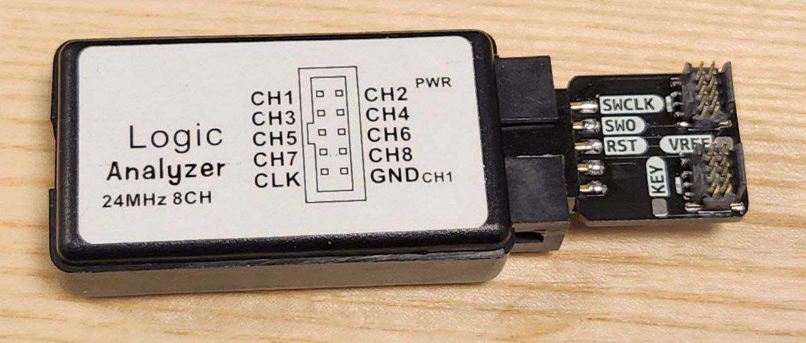

# Probe debug board for cheap logic analyzers

A simple board to probe the SWD/JTAG signals from a debug probe.

Designed to work with a cheap "24 MHz usb logic analyzer", can be found on Aliexpress or similar.

